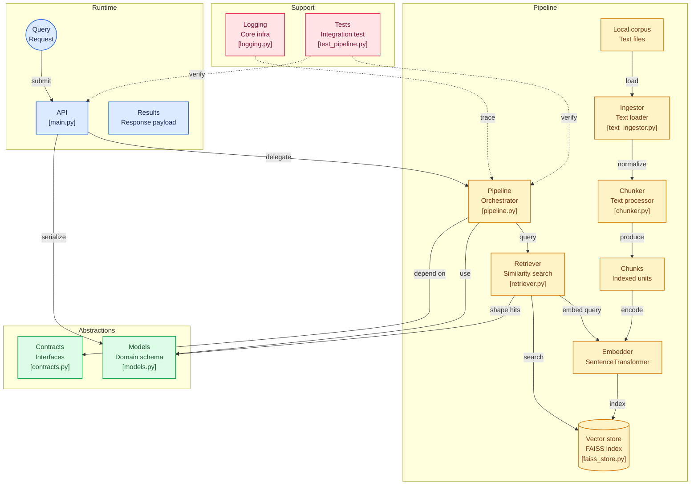

# GODSPEED

Godspeed is an AI-native search engine that transforms the web into structured, real-time, citation-backed knowledge for humans and AI agents

---

## why?

traditional search engines give you documents to read

AI systems need something different:
- structured knowledge
- verifiable sources
- fast retrieval
- reasoning-ready outputs

---

## what it does

given a query, Godspeed:

- retrieves relevant information from local or external sources
- breaks content into meaningful semantic chunks
- ranks results by relevance
- attaches source citations
- returns structured, machine-readable answers

it is designed to power:
- AI agents
- research systems
- intelligent assistants
- RAG pipelines

---

## architecture

`godspeed/` is split by responsibility to support both local execution and future distributed scaling: 

- **ingestion**: loads raw content (`TextDirectoryIngestor`)
- **processing**: cleaning + chunking (`FixedSizeChunkProcessor`)
- **embedding**: embedding interface (`SentenceTransformerEmbedder`)
- **storage**: vector index layer (`FaissVectorStore`)
- **retrieval**: ranking + search logic (`Retriever`)
- **pipeline**: end-to-end orchestration (`SearchPipeline`)
- **api**: fastAPI service exposing query endpoints
- **interfaces**: abstract contracts for swapping components with distributed systems (vector DBs, remote embedding services, queues, etc..)

---

## diagram



---

## current implementation

- embeddings: `sentence-transformers` (`all-MiniLM-L6-v2`)
- vector search: local `FAISS`
- API layer: `fastAPI`
- input source: local text corpus (`.txt` files)

---

## quickstart

```bash
python -m venv .venv
source .venv/bin/activate
pip install -r requirements.txt
```

create a corpus
```
mkdir -p corpus
echo "Godspeed builds AI-native retrieval systems." > corpus/doc1.txt
echo "FAISS enables fast vector similarity search." > corpus/doc2.txt
```

run 
```
export GODSPEED_CORPUS_DIR=./corpus
uvicorn godspeed.api.main:app --reload
```

---

## API
### health check
`GET /health`

### query
`POST /query`

```
{
  "query": "vector search systems",
  "top_k": 3
}
```

response:
```
{
  "query": "vector search systems",
  "hits": [
    {
      "rank": 1,
      "score": 0.83,
      "chunk_id": "doc1:0",
      "doc_id": "doc1",
      "citation": {
        "source": "corpus/doc1.txt"
      },
      "text": "Godspeed builds AI-native retrieval systems."
    }
  ]
}
```
